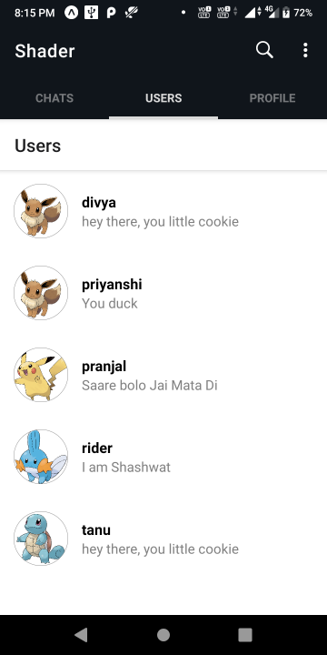
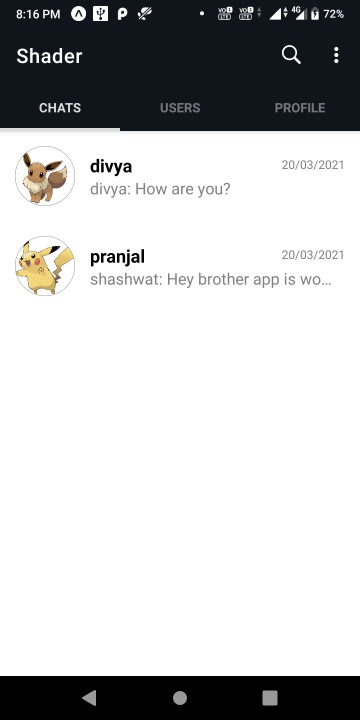
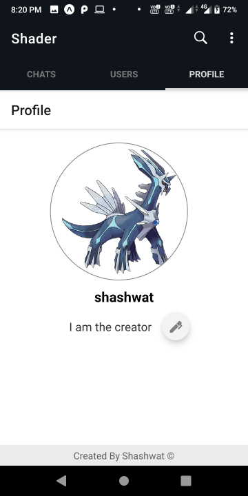
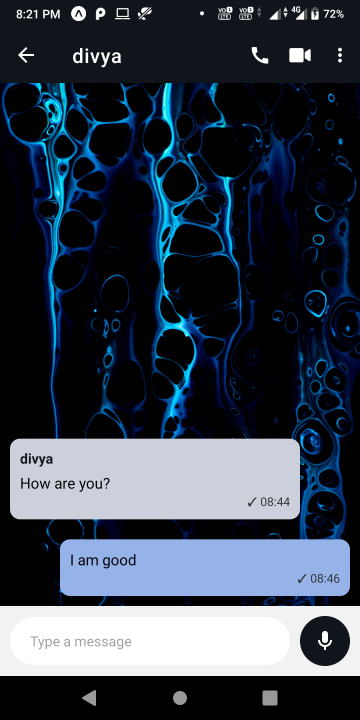

# Shader-messenger
A realtime Chat application using react-native , aws-amplify and graphql

This is my first App, so it does have some minor bugs but the messaging functionality is working good.

# Screenshots

